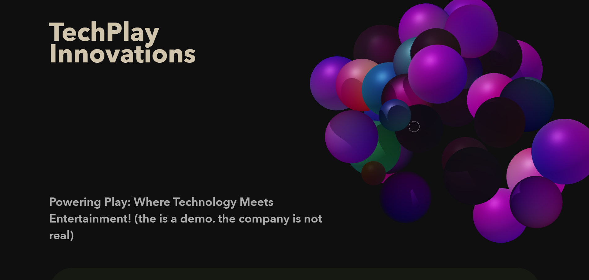

# Arcade Programming Agency Website - "The Story of The Three Graces" 🎮✨

This repository hosts a demo project for Arcade Programming Agency, a fictional digital creative studio specializing in immersive, interactive web experiences. Built with **Three.js**, the demo showcases how a simple website can be transformed into a dynamic, 3D experience, bringing content to life in a way that traditional HTML and CSS alone cannot achieve.

### About
**Arcade Programming Agency Website** is a visually interactive web experience that uses **Three.js** to create a 3D interactive elements. Developed by **Os Al Haddad**, this demo illustrates the potential of 3D web content to engage users through interactive elements. Imagine a static website—and then watch it evolve through the addition of dynamic 3D scenes, fluid animations, and responsive, engaging interactions.



### Live Link
Check out the live demo:
[Live: Arcade Programming Agency - Three Graces Project](**LinkHere**)

### Project Features
- **Interactive 3D Scene**: Smoothly rendered visuals using **Three.js**.

### Getting Started
#### Prerequisites
- **Node.js**: Download and install Node.js from [https://nodejs.org/en/download/](https://nodejs.org/en/download/).
  
#### Installation
1. Clone or download this repository.
2. Open the project folder in **VS Code** or your preferred editor.
3. Open the terminal within the editor and install dependencies:

    ```bash
    npm install
    ```

#### Running the Project
To run the project locally:
1. Run the following command in the terminal:

    ```bash
    npm run dev
    ```

### Notes
If you enjoy the project or find it helpful, please consider giving it a ⭐ on GitHub. It helps others discover the work and supports future development!
